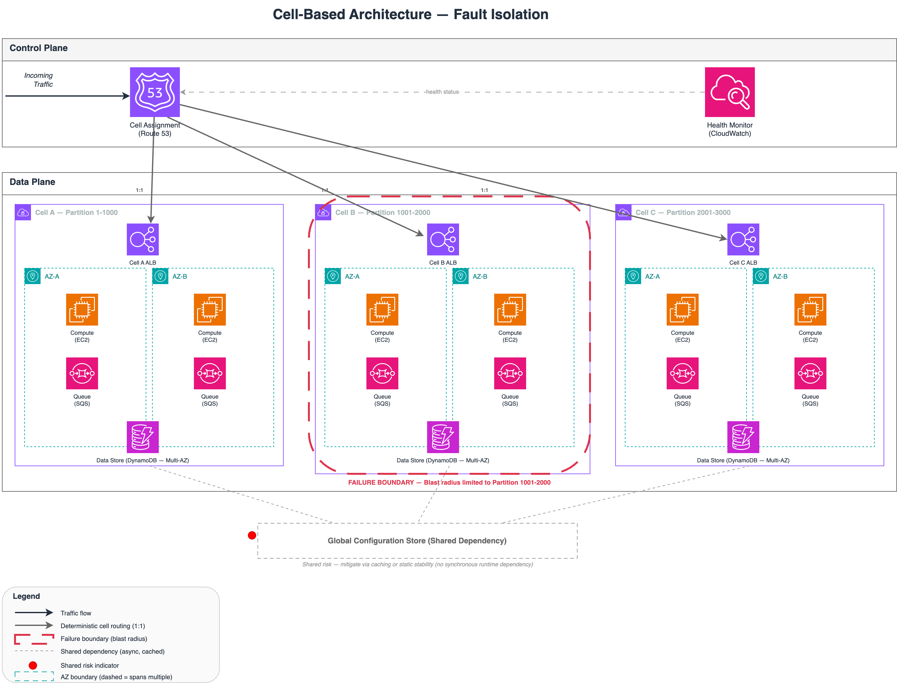

# Cell-Based Architecture for Fault Isolation in Distributed Systems

## Date

2026-02-26

## Problem

Large-scale distributed systems that share infrastructure across all tenants or workloads expose themselves to correlated failures. A single defect, a poisonous request, or a capacity exhaustion event in one part of the system can cascade across the entire fleet. The blast radius of any failure is the entire system. This is unacceptable for services with strict availability requirements.

## Context

This article addresses systems operating at scale where hundreds of thousands or millions of requests per second are processed, where multi-tenant isolation is a requirement, and where the cost of a full-fleet outage is measured in significant business impact. The discussion assumes stateful or semi-stateful workloads where simple horizontal scaling behind a load balancer is insufficient to contain failures. The pattern applies to backend service architectures, not to client-side or edge-only systems.

## Architecture Pattern

Cell-based architecture partitions a system into multiple independent, self-contained units called cells. Each cell is a complete replica of the service stack: compute, storage, queueing, and any other dependencies required to serve its assigned partition of traffic.

A cell is a logical failure isolation boundary at the service architecture layer. It must not be conflated with a single availability zone or a single data center. In production systems, a cell typically spans multiple availability zones to provide intra-cell high availability. The isolation boundary is architectural, not merely infrastructural. Two cells may run in the same physical facilities and still maintain complete failure independence at the service layer.

A routing layer in the control plane assigns incoming requests to a specific cell based on a partition key, typically derived from tenant ID, account ID, or geographic region. Once assigned, a request is processed entirely within that cell. Cells are designed to avoid synchronous cross-cell dependencies during request processing. Limited asynchronous replication or global metadata exchange may exist between cells, but synchronous failure coupling between cells must be eliminated.

The critical property is isolation. A failure within Cell A does not propagate to Cell B or Cell C. The blast radius of any single-cell failure is bounded to the partition of traffic assigned to that cell. If a cell serves 5% of total traffic, a complete cell failure affects only that 5%.

The control plane is responsible for cell assignment, health monitoring, and, in some implementations, cell evacuation. The data plane is the collection of cells themselves. This separation is fundamental: the data plane must remain operational even if the control plane experiences transient unavailability. This property is known as static stability.

## Failure Modes & Blast Radius

**Cell-local compute failure.** A deployment defect or resource exhaustion within a single cell's compute layer. Affected scope: single cell only. Traffic assigned to other cells is unaffected. Recovery: roll back the deployment within the affected cell or allow auto-scaling to replace failed instances.

**Cell-local data store corruption.** A data integrity issue within one cell's storage layer. Affected scope: single cell. Other cells maintain independent data stores. Recovery: restore from backup or failover to a replica within the cell.

**Control plane unavailability.** The cell assignment service becomes unreachable. Affected scope: potentially global for new requests, but existing cell assignments continue to function if clients cache their assignments. This is the static stability property. Recovery: restore the control plane. Existing traffic continues uninterrupted.

**Shared dependency failure.** Shared services are not inherently prohibited in a cell-based architecture. The architectural risk arises from synchronous runtime dependency in the request path. A global configuration store that is read-only, versioned, and aggressively cached is acceptable if cells can continue operating during temporary global service unavailability. The failure becomes dangerous when cells require synchronous reads from a shared service to process individual requests. In that case, a shared service outage affects all cells simultaneously. Affected scope: global. Mitigation requires caching with bounded staleness, local fallbacks, or elimination of the synchronous dependency.

**Partition key hotspot.** An uneven distribution of traffic across cells due to a skewed partition key. Affected scope: single cell (overloaded), but can degrade to a broader issue if the overloaded cell triggers cascading retries. Recovery: rebalance partition assignments or split the hot cell.

**Cascading overload after cell failure.** When a cell fails and its traffic is redistributed to surviving cells, those cells must have sufficient capacity headroom to absorb the additional load. Without per-cell capacity buffers, the redistribution itself can trigger cascading overload across the remaining cells. Isolation reduces blast radius but does not eliminate the need for capacity engineering. Each cell must be provisioned not only for its own peak load but also for a share of redistributed traffic from a failed peer.

## Trade-offs

Cell-based architecture trades operational simplicity for failure containment. The costs are real.

Duplication of infrastructure increases total resource consumption. Each cell runs its own stack, which means more instances, more storage, and more operational surface area. Cost efficiency decreases compared to a shared-everything model.

Deployment complexity increases. Rolling out changes across dozens or hundreds of cells requires orchestration. Canary deployments become cell-level canaries, which is more granular but also more complex to manage.

Cross-cell operations are difficult. Any operation that must span multiple cells, such as a global query or a cross-tenant report, requires aggregation logic that adds latency and complexity.

Cell sizing is a design decision with long-term consequences. Too few cells and the blast radius remains large. Too many cells and the operational overhead becomes prohibitive. There is no universal formula; the right number depends on traffic volume, failure tolerance, and team capacity.

## When to Use

- Systems with strict availability SLAs where full-fleet outages are unacceptable.
- Multi-tenant platforms where tenant isolation is a contractual or regulatory requirement.
- Services processing high request volumes where a single failure must not affect the majority of users.
- Organizations with the operational maturity to manage multiple independent deployment units.

## When Not to Use

- Small-scale systems where the blast radius of a full outage is acceptable.
- Stateless services that can be trivially scaled horizontally without isolation concerns.
- Teams without the tooling or operational discipline to manage multi-cell deployments.
- Systems where cross-cell queries are the primary access pattern, as the aggregation cost may negate the isolation benefit.

## Operational Considerations

Monitoring must be cell-aware. Aggregate metrics across the fleet will mask cell-level degradation. Each cell requires independent health signals: error rates, latency percentiles, and saturation metrics. Alerting must trigger on per-cell thresholds, not fleet-wide averages.

Deployment pipelines must support cell-level rollouts. A common pattern is to deploy to a single canary cell, observe for a bake period, then proceed to a rolling deployment across remaining cells. Rollback must be possible at the individual cell level.

Debugging requires cell-aware tooling. When investigating an incident, operators must be able to identify which cell is affected, inspect its state independently, and correlate logs and traces within that cell's boundary.

Capacity planning shifts from fleet-level to cell-level. Each cell must be provisioned to handle its assigned partition's peak load, plus headroom for failover scenarios where traffic from a failed cell is redistributed.

## Diagram Walkthrough

The accompanying diagram illustrates a three-cell deployment. The Control Plane lane at the top contains the Router, Cell Assignment Service, and Health Monitor. Incoming traffic enters through the Router, which consults the Cell Assignment Service to determine the target cell. The Health Monitor feeds cell health status back to the assignment service.

The Data Plane lane contains three cells (A, B, C), each with its own compute, queue, and data store. The dashed red boundary around Cell B represents a failure scenario: the blast radius is contained entirely within Cell B's partition (1001-2000). Cells A and C continue operating normally.

The dotted box at the bottom represents a Global Configuration Store, a shared dependency connected to all cells. This is the primary risk to the isolation model and must be mitigated through caching or local fallback mechanisms.

## Implementation Notes

Partition key selection is the most consequential implementation decision. The key must distribute traffic evenly across cells and must be stable over time. Tenant ID or account ID are common choices. Geographic region works for location-bound workloads.

Cell sizing should start conservative. Begin with fewer, larger cells and split as operational confidence grows. Automated cell provisioning reduces the cost of adding new cells over time.

Static stability requires that cells cache their configuration locally. If the control plane becomes unavailable, cells must continue serving requests using their last known configuration. This implies that configuration changes propagate asynchronously and that cells tolerate stale configuration for bounded periods.

Health checking must distinguish between cell-level and component-level failures. A single failed instance within a cell is not a cell failure. Cell-level health is determined by aggregate metrics across the cell's components.

Cell-based architecture represents hard partitioning with strict isolation boundaries. Each cell owns its partition exclusively, and failure within one cell has no probabilistic overlap with any other cell. This is distinct from shuffle sharding, which provides probabilistic isolation by assigning each tenant to a randomized subset of overlapping shards. Both approaches reduce correlated failure risk. Cells provide deterministic blast-radius containment at the cost of higher infrastructure duplication. Shuffle sharding provides statistical isolation with better resource efficiency but weaker worst-case guarantees. The choice between them depends on whether the system requires absolute containment or can tolerate probabilistic risk reduction.

## References

- [Shuffle Sharding: Massive and Magical Fault Isolation (Colm MacCarthaigh)](https://aws.amazon.com/builders-library/workload-isolation-using-shuffle-sharding/)
- [Static Stability Using Availability Zones](https://aws.amazon.com/builders-library/static-stability-using-availability-zones/)

## Tags

`cell-architecture` `blast-radius` `isolation` `fault-containment` `resilience` `control-plane` `data-plane` `static-stability`
