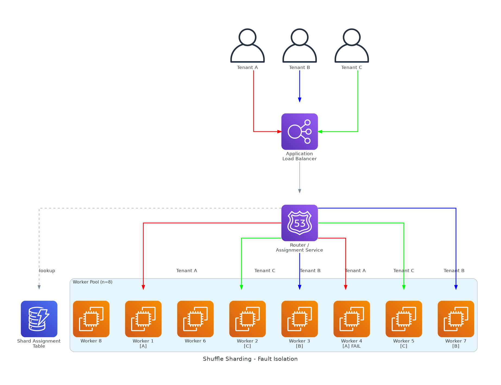

# Shuffle Sharding for Probabilistic Fault Isolation

## Date

2026-03-15

## Problem

Traditional partitioning strategies assign each tenant to a single shard. When that shard fails, every tenant on it is affected. The blast radius is bounded but deterministic: all tenants sharing infrastructure with the failing component experience the outage together. For systems where total isolation per tenant is cost-prohibitive, this creates an uncomfortable choice between expensive full isolation and accepting large correlated failure groups.

## Context

This article addresses multi-tenant systems at scale where thousands or tens of thousands of tenants share a pool of backend resources (worker fleets, databases, queues, caches). Full per-tenant isolation (one shard per tenant) is economically impractical. Simple partitioning (hash tenants to N shards) bounds blast radius to 1/N of tenants but guarantees that all tenants on a failed shard fail together. The discussion assumes the system can tolerate brief disruption for individual tenants and that the goal is minimizing the probability of correlated multi-tenant failures rather than eliminating all failure.

## Architecture Pattern

Shuffle sharding assigns each tenant to a unique, randomly selected subset of resources drawn from a shared pool. Instead of mapping a tenant to a single shard, the system assigns each tenant to a combination of k resources chosen from a pool of n total resources.

Consider a system with 8 worker shards and a shuffle shard size of 2. Each tenant is assigned to a unique pair of workers. The number of possible unique pairs is C(8,2) = 28. If Tenant A is assigned to workers {1, 4} and Tenant B is assigned to workers {3, 7}, a failure of worker 1 affects Tenant A but not Tenant B. For Tenant B to experience the same failure as Tenant A, workers 1 and 4 must both fail simultaneously. The probability of two tenants sharing the exact same failure experience drops combinatorially.

The key insight is that the number of unique combinations grows rapidly with pool size and shard size. With n=100 resources and k=5 per tenant, C(100,5) = 75,287,520 unique combinations. The probability that two randomly assigned tenants share all k resources is astronomically low: 1 in 75 million.

A routing layer assigns each tenant to its shuffle shard at provisioning time or first request. The assignment is stored and reused for subsequent requests. Traffic for a given tenant is distributed across its assigned subset of resources. If one resource in the subset fails, the tenant's traffic is redistributed to the remaining resources in its subset.

## Failure Modes & Blast Radius

**Single resource failure.** One worker or shard in the pool fails. Affected scope: only tenants whose shuffle shard includes the failed resource, and only partially — each affected tenant still has k-1 healthy resources. With n=8 and k=2, a single resource failure affects at most C(7,1)/C(8,2) = 25% of possible assignments. With n=100 and k=5, a single failure affects approximately 5% of assignments, and those tenants retain 80% of their capacity.

**Multiple correlated resource failures.** Two or more resources fail simultaneously. The probability that a specific tenant's entire shuffle shard fails requires all k assigned resources to fail. If each resource has independent failure probability p, the probability of total tenant isolation failure is p^k. For p=0.01 and k=5, this is 10^-10 — effectively zero for independent failures.

**Noisy neighbor / poisonous tenant.** A tenant generating toxic traffic (malformed requests, excessive load) affects only the resources in its shuffle shard. Other tenants assigned to different resource subsets are unaffected. Tenants sharing one resource with the toxic tenant experience partial degradation, not total failure. This is the primary operational advantage over simple partitioning.

**Assignment skew.** Random assignment can produce uneven load distribution. Some resources may be assigned to more tenants than others. Mitigation: use consistent hashing with virtual nodes, or implement assignment-time balancing that selects from the least-loaded eligible resources.

**Correlated infrastructure failure.** Shuffle sharding assumes resource failures are independent. If all resources share a common dependency (network switch, availability zone, control plane), a failure of that dependency defeats the isolation model. Mitigation: ensure the resource pool spans independent failure domains.

## Trade-offs

Shuffle sharding trades deterministic isolation for probabilistic isolation with better resource efficiency. The costs are specific.

Resource sharing means that isolation is statistical, not absolute. Two tenants may share one or more resources. While the probability of total overlap is vanishingly small, partial overlap exists. For systems requiring guaranteed zero-overlap isolation, shuffle sharding is insufficient — cell-based architecture with dedicated resources per cell is the appropriate pattern.

Routing complexity increases. The system must store and enforce per-tenant shard assignments. Assignment lookups add latency to the request path unless cached aggressively. The assignment store itself becomes a dependency that must be highly available.

Capacity planning becomes probabilistic. Unlike simple sharding where each shard's tenant count is deterministic, shuffle sharding produces a distribution of load across resources. Capacity must be planned for the statistical worst case, not the average.

Debugging is harder. When a tenant reports degradation, the operator must identify which specific subset of resources serves that tenant. Tooling must support per-tenant resource mapping.

Rebalancing is disruptive. Changing a tenant's shard assignment mid-flight requires draining connections and migrating state. This is operationally expensive for stateful workloads.

## When to Use

- Multi-tenant platforms where per-tenant isolation is desired but dedicated infrastructure per tenant is cost-prohibitive.
- Systems where noisy-neighbor effects are a recurring operational problem.
- Services with large tenant counts where the combinatorial math provides meaningful isolation guarantees.
- Workloads where partial degradation (losing one of k resources) is tolerable.

## When Not to Use

- Systems requiring absolute isolation guarantees (regulatory, contractual). Use cell-based architecture instead.
- Small resource pools where the combinatorial space is too small to provide meaningful isolation. C(4,2) = 6 is not meaningful isolation.
- Stateful workloads where reassigning a tenant to a different resource subset requires expensive data migration.
- Systems with highly correlated failure domains that violate the independence assumption.

## Operational Considerations

Monitoring must track per-resource and per-tenant metrics. Aggregate fleet metrics will mask the localized impact of a single resource failure on its assigned tenants. Operators need dashboards that answer: "Which tenants are assigned to this failing resource?" and "Which resources serve this degraded tenant?"

Assignment storage must be durable and highly available. Loss of assignment data forces reassignment, which may cause connection resets and state migration. The assignment store should be replicated and backed up.

Resource pool changes (adding or removing workers) require reassignment decisions. Adding a resource is straightforward — new tenants can be assigned to combinations including the new resource. Removing a resource requires reassigning all tenants that included it in their shuffle shard. Consistent hashing techniques can minimize reassignment churn.

Health checking must be resource-granular. The system must detect individual resource failures quickly and reroute affected tenants to their remaining healthy resources. Health check latency directly determines tenant impact duration.

## Diagram Walkthrough

The diagram illustrates shuffle sharding with a pool of 8 backend workers behind an Application Load Balancer. Three tenants are shown with their shuffle shard assignments:

- Tenant A (red) is assigned to Workers 1 and 4.
- Tenant B (blue) is assigned to Workers 3 and 7.
- Tenant C (green) is assigned to Workers 2 and 5.

The Router / Assignment Service sits between the load balancer and the worker pool, directing each tenant's traffic to its assigned subset. A DynamoDB table stores the tenant-to-shard mappings.

Worker 4 is shown in a failure state. The blast radius is limited: only Tenant A is affected, and only partially — Tenant A still has Worker 1 available. Tenants B and C are completely unaffected because their shuffle shards do not include Worker 4. In a traditional single-shard model, all tenants assigned to the same shard as Worker 4 would fail together.

## Implementation Notes

Shard size (k) is the primary tuning parameter. Larger k increases isolation (more unique combinations) and resilience (more surviving resources per failure), but decreases resource efficiency (each tenant consumes more resources). Start with k=2 for cost-sensitive workloads. Use k=3-5 for workloads where isolation and resilience justify the overhead.

Pool size (n) should be large enough to make the combinatorial space meaningful. As a rough heuristic, C(n,k) should be at least 10x the tenant count to ensure low collision probability.

Assignment algorithms should incorporate load awareness. Pure random selection from C(n,k) possibilities works mathematically but can produce unbalanced assignments in practice. A load-aware algorithm selects the k least-loaded resources that form a valid combination, preserving the isolation properties while improving balance.

Shuffle sharding composes well with other resilience patterns. Combine it with circuit breakers at the resource boundary to fast-fail when a resource in a tenant's shard is unhealthy. Combine it with retry budgets to prevent a failing resource from generating retry storms across all its assigned tenants.

The relationship to cell-based architecture is complementary, not competitive. Cells provide deterministic, hard isolation boundaries for the highest-tier workloads. Shuffle sharding provides probabilistic isolation with better resource efficiency for the broad middle tier. A system can use cells for its most critical tenants and shuffle sharding for the remainder.

## References

- [Shuffle Sharding: Massive and Magical Fault Isolation (Colm MacCarthaigh)](https://aws.amazon.com/builders-library/workload-isolation-using-shuffle-sharding/)
- [Static Stability Using Availability Zones](https://aws.amazon.com/builders-library/static-stability-using-availability-zones/)
- [Cell-Based Architecture for Fault Isolation](../2026-02-26-cell-based-architecture/post.md)

## Tags

`shuffle-sharding` `blast-radius` `isolation` `fault-containment` `resilience` `multi-tenant` `noisy-neighbor` `probabilistic-isolation`
